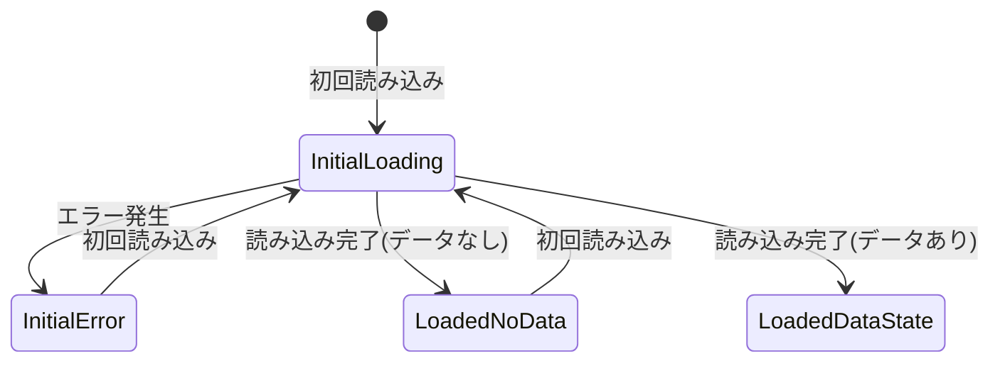
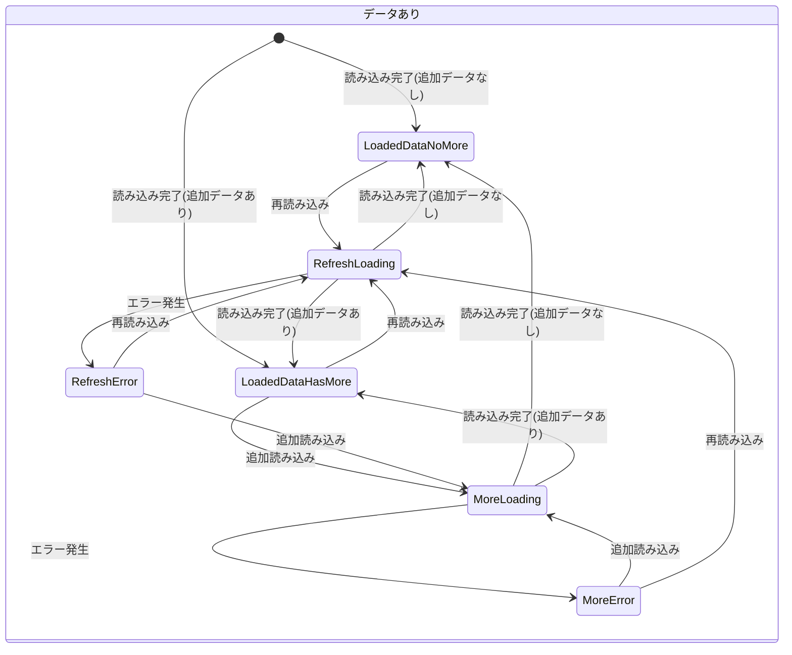

[Flutter Advent Calendar 2024](https://qiita.com/advent-calendar/2024/flutter) の 18 日目の記事です。

## はじめに

ページネーション(無限スクロール)の実装において、**「画面上に存在する状態の種類と、各状態における適切な表示・処理の定義」** がとても重要です。

以下のような実装シーンについて検討する必要があります。

- **初回データ読み込み時**  
  ユーザーへの適切な待機状態の表示方法
- **既存リストへの追加読み込み時**  
  表示中のデータを維持しながらの読み込み状態の表現方法
- **Pull-to-Refresh による最新データ取得時**  
  画面更新中の状態管理方法

これらの場面では、「読み込み中」「エラー発生」などの状態表現や、既存データの維持・破棄の判断が必要となります。

本稿では、**「現在の状態を明確に表現する」** 手段として、Dart 3 の `sealed class` を活用した設計方法について考察します。

## 1. 状態の細分化が必要となる理由

### 1-1. 状態の単純化による課題

画面の状態を「読み込み中・成功・失敗」という単純な３分類で表現した場合、以下のような問題が発生します。

- 初回データ取得
- 追加データの読み込み
- Pull-to-Refresh による更新

これらの処理は全て「読み込み中 (Loading)」という同一の状態として扱われることになります。

しかし、実際の画面実装では以下のような異なる表示が必要となります。

- 初回読み込み時は画面中央にインジケータを表示
- 追加読み込み時は画面下部にローディングを表示
- Pull-to-Refresh 時は上部にインジケータを表示

このように、**同じ「読み込み中」でも表示の仕方が大きく異なります**。

エラーが発生した場合も同様の状況が見られます。

- 初回読み込みで失敗した場合は画面全体に大きくエラーメッセージを表示
- 追加読み込みで失敗した場合はリスト下部に小さく「リトライ」ボタンを配置
- Pull-to-Refresh 失敗時は上部に通知を表示

このように、同じような状態でも**文脈に応じて適切な表示方法を選択する必要があります**。

### 1-2. データの有無による画面表示の違い

ページネーションを実装する際の重要な考慮点として、「現在画面にデータが表示されているかどうか」があります。

具体的には以下のような違いが生じます。

- **データが存在しない状態の場合**
  - 画面全体に Skeleton UI を表示
  - エラーが発生した場合は大きく「再読み込み」ボタンを表示
  - 「まだ投稿がありません」などのメッセージを中央に配置

- **データが表示されている状態の場合**
  - 画面下部に小さくローディングを表示
  - エラーが発生しても既存のデータは維持したまま、下部にリトライボタンを表示

このように、**データの有無に応じて画面の表示方法を適切に変更する必要があります**。

## 2. 実装方法の検討

これらの状態を適切に表現するため、Dart 3 の `sealed class` を活用した以下のような設計を提案いたします。

```dart
/// ページネーションの状態を表現するクラス
sealed class PaginationState<T> {
  const PaginationState();

  // 初回読み込み関連
  const factory PaginationState.initialLoading() = InitialLoading<T>;
  const factory PaginationState.initialError(Exception exception) = InitialError<T>;
  
  // 読み込み完了関連
  const factory PaginationState.loadedNoData() = LoadedNoData<T>;
  const factory PaginationState.loadedDataNoMore(List<T> items) = LoadedDataNoMore<T>;
  const factory PaginationState.loadedDataHasMore(List<T> items) = LoadedDataHasMore<T>;
  
  // 追加読み込み関連
  const factory PaginationState.moreLoading(List<T> items) = MoreLoading<T>;
  const factory PaginationState.moreError(List<T> items, Exception exception) = MoreError<T>;
  
  // 再読み込み関連
  const factory PaginationState.refreshLoading(List<T> items) = RefreshLoading<T>;
  const factory PaginationState.refreshError(List<T> items, Exception exception) = RefreshError<T>;
}
```

:::details 継承クラスの詳細実装

```dart
/// ページネーションのアイテムを表現する型
typedef PaginationItems<T> = List<T>;

/// 初回読み込み中
final class InitialLoading<T> extends PaginationState<T> {
  const InitialLoading();
}

/// 初回読み込みエラー
final class InitialError<T> extends PaginationState<T> {
  const InitialError(this.exception);
  final Exception exception;
}

/// 読み込み完了(データなし)
final class LoadedNoData<T> extends PaginationState<T> {
  const LoadedNoData();
}

/// 読み込み完了(データあり)の基底クラス
sealed class LoadedDataState<T> extends PaginationState<T> {
  const LoadedDataState(this.items);

  final PaginationItems<T> items;
}

/// 読み込み完了(データあり)で追加読み込みなし
final class LoadedDataNoMore<T> extends LoadedDataState<T> {
  const LoadedDataNoMore(super.items);
}

/// 読み込み完了(データあり)で追加読み込みあり
final class LoadedDataHasMore<T> extends LoadedDataState<T> {
  const LoadedDataHasMore(super.items);
}

/// 追加読み込み中
final class MoreLoading<T> extends LoadedDataState<T> {
  const MoreLoading(super.items);
}

/// 追加読み込みエラー
final class MoreError<T> extends LoadedDataState<T> {
  const MoreError(super.items, this.exception);
  final Exception exception;
}

/// 再読み込み中
final class RefreshLoading<T> extends LoadedDataState<T> {
  const RefreshLoading(super.items);
}

/// 再読み込みエラー
final class RefreshError<T> extends LoadedDataState<T> {
  const RefreshError(super.items, this.exception);
  final Exception exception;
}
```

:::

このように状態を分けることで、例えばこんな実装ができます。

```dart
Widget build(BuildContext context) {
  return switch (state) {
    // 初回読み込み時
    InitialLoading() => LoadingView(),

    // 初回読み込みエラー
    InitialError(exception: final e) => ErrorView(
          exception: e,
          onRetry: retry,
        ),
    
    // 読み込み完了(データなし)
    LoadedNoData() => EmptyView(
        onRetry: retry,
    ),
    
    // 読み込み完了(データあり)
    LoadedDataState(items: final items) => LoadedDataView(
        items: items,
        onLoadMore: loadMore,
        onRefresh: refresh,
      ),
  };
}
```

:::details LoadedDataView の実装例

```dart
/// 読み込み完了(データあり)の表示
class LoadedDataView<T> extends ConsumerWidget {
  const LoadedDataView({
    super.key,
    required this.items,
    required this.onLoadMore,
    required this.onRefresh,
  });

  final PaginationItems<T> items;
  final VoidCallback onLoadMore;
  final VoidCallback onRefresh;

  @override
  Widget build(BuildContext context, WidgetRef ref) {
    return RefreshIndicator(
      onRefresh: () async {
        onRefresh();
      },
      child: ListView.builder(
        itemCount: items.length + 1,  // +1 は Footer 用
        itemBuilder: (context, index) {
          // Footer の表示
          if (index == items.length) {
            return switch (state) {
              // 追加読み込み中
              MoreLoading() => const Center(
                  child: Padding(
                    padding: EdgeInsets.all(16),
                    child: CircularProgressIndicator(),
                  ),
                ),
              
              // 追加読み込みエラー
              MoreError() => Center(
                  child: Padding(
                    padding: const EdgeInsets.all(16),
                    child: ElevatedButton(
                      onPressed: onLoadMore,
                      child: const Text('再読み込み'),
                    ),
                  ),
                ),
              
              // まだ追加データがある
              LoadedDataHasMore() => Center(
                  child: Padding(
                    padding: const EdgeInsets.all(16),
                    child: ElevatedButton(
                      onPressed: onLoadMore,
                      child: const Text('もっと見る'),
                    ),
                  ),
                ),
              
              // 最後まで読み込み完了
              LoadedDataNoMore() => const SizedBox.shrink(),
              
              // その他の状態 (通常はここには到達しない)
              _ => const SizedBox.shrink(),
            };
          }

          // リストアイテムの表示
          final item = items[index];
          return ItemCard(item: item);
        },
      ),
    );
  }
}
```

:::

## 3. 状態の遷移を整理してみよう

状態がたくさんあって混乱してしまったり、見落としたりしないようにするために、状態の遷移を図に起こしてみましょう。

まずは、データがない状態です。



次に、データがある状態です。



:::message
再読み込みエラー(`RefreshError`)など細かく分けていることで、エラーの種類に応じた適切な処理を実装しやすくなっています。
例えば、`ref.listen()` で `RefreshError` を監視しておくことで、再読み込みでエラーが発生した場合に `SnackBar` や `Dialog` を簡単に表示することができます。
:::

あくまで例ではありますが、状態遷移図の全体像は以下の通りです。


*ページネーションの状態遷移図*

## 4. 実装時の重要な考慮点

状態を細かく分類すると一見複雑に見えますが、以下の点に注意して整理して実装することで、よりスッキリした設計となります。

1. **必要な状態の選択**
   - Pull-to-Refresh 機能が不要な画面では `RefreshLoading` や `RefreshError` は省略可能
   - 要件に応じて、状態の数を適切に調整することが重要

2. **エラーからの復帰手段の提供**
   - 追加読み込み失敗時にはリトライボタンを表示
   - 再読み込み失敗時には `SnackBar` などでエラーを通知し、既存の状態を維持

3. **既存データの適切な管理**
   - 追加読み込みや再読み込み中は既存データを維持
   - エラー発生時も可能な限りデータを保持

## まとめ

ページネーションの実装には、一見想定以上の考慮点が存在します。
しかし、状態を適切に整理して実装することで、以下のような利点が得られます。

- 🔍 画面状態の明確な把握が可能
- ⚡️ エラー処理の実装が容易
- 🎨 UI の条件分岐がより整理された形に

各プロジェクトの要件に応じて、必要な状態を適切に選択し、保守性の高い設計を目指すことをおすすめいたします。
